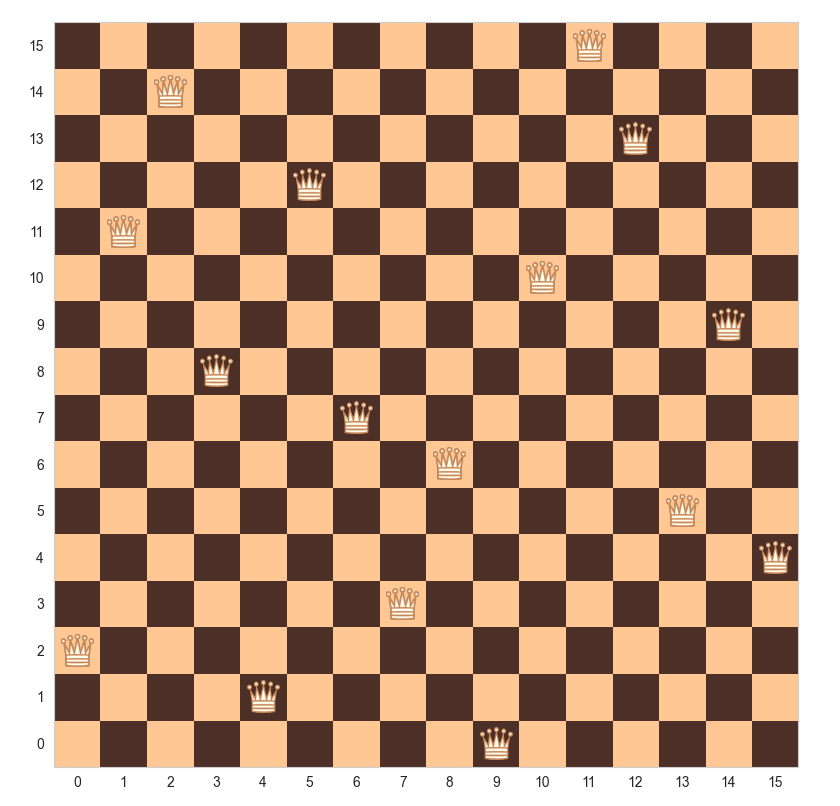
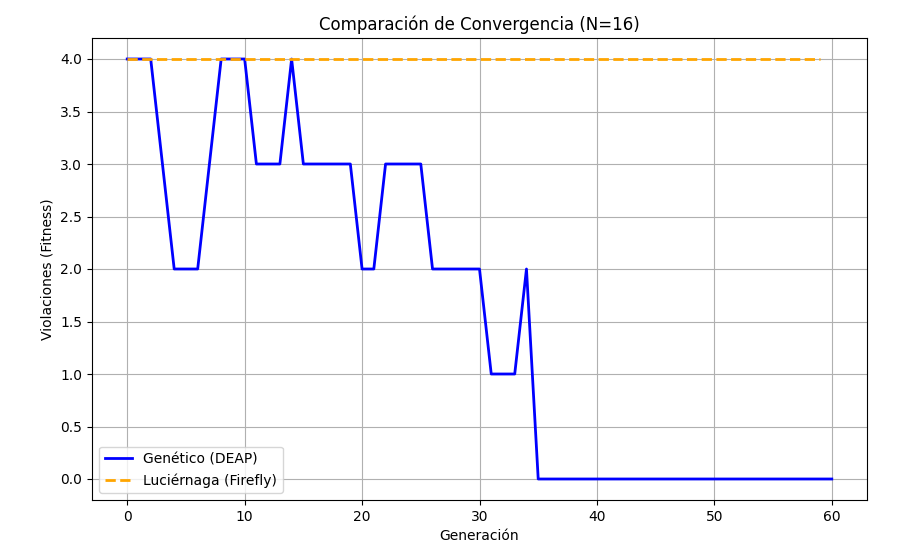

#  Solucionador N-Reinas: Comparativa de Algoritmos Bio-Inspirados

Este proyecto implementa, analiza y compara dos algoritmos metaheurísticos para resolver el clásico problema de las **8 Reinas (N-Queens Problem)** pero en este caso se tomará como referencia **16 Reinas**:
1.  **Algoritmo Genético (GA):** Implementado utilizando la librería `DEAP`.
2.  **Algoritmo de Luciérnaga (Firefly Algorithm):** Implementación propia adaptada para espacios discretos.

El objetivo principal es evaluar la eficiencia en **tiempo de ejecución**, **convergencia** y **precisión** de ambas estrategias para encontrar una configuración donde ninguna reina se ataque entre sí.

### Ejemplo de Solución (Tablero 16x16)


### Gráfica Comparativa entre los dos algortimos

 
##  Estructura del Proyecto

* `n_queens.py`: Implementación del **Algoritmo Genético** (DEAP).
* `firefly_solver.py`: Implementación personalizada del **Algoritmo de Luciérnaga**.
* `compare_algorithms.py`: Script principal ("El Árbitro") que ejecuta ambos algoritmos bajo condiciones idénticas y genera las gráficas comparativas.
* `queens.py`: Lógica del tablero, reglas de ajedrez y cálculo de fitness (violaciones).
* `elitism.py`: Módulo auxiliar para aplicar elitismo en el proceso evolutivo.

##  Instalación y Requisitos

Asegúrate de tener Python 3.x instalado. Instala las dependencias necesarias ejecutando:

```bash
pip install deap numpy matplotlib seaborn
